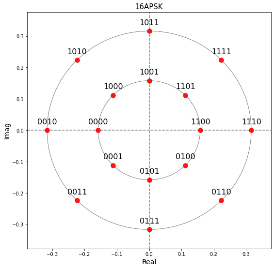
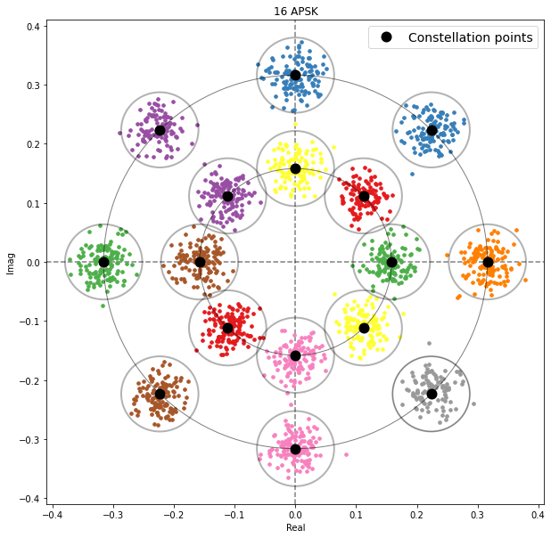
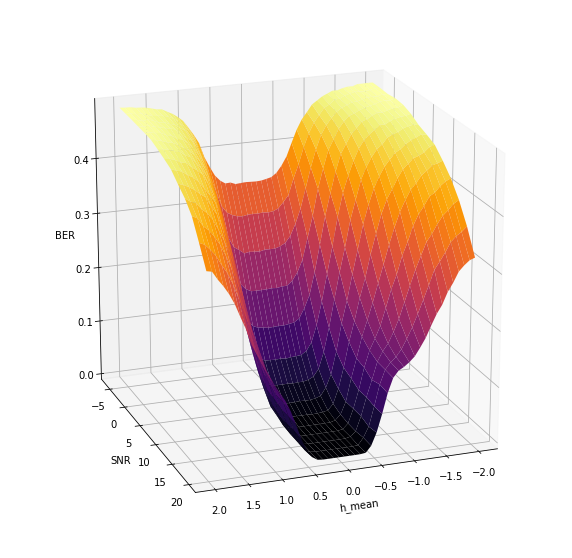
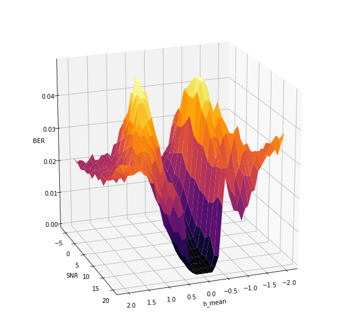
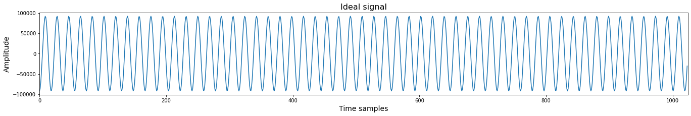
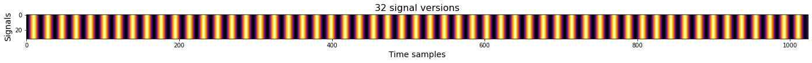
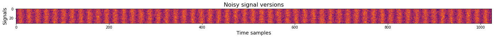

# ML_for_Wireless_communication

Homeworks for the Machine learning for wireless communication course.
This course was devoted to learning how to solve some important problems of wireless communication using machine learning techniques.
The solutions were individual; we got only problem formulation and no hints on how to solve it so that results might differ from expectations. 
The course took place April-May in 2021 (1st year).

## [APSK16 optimization](https://github.com/Albly/ML_for_Wireless_communication/blob/main/APSK16_optimization.ipynb)
Here we constructed an APSK16 modulator and demodulator with different radius ratios. 
The idea was to find an optimal ratio for a given noise level to minimize bit error rate during demodulation.

APSK16 constellation with Gray mapping                     |  APSK16 constellation with noisy points
:---------------------------------------------------------:|:-------------------------:
  |  

## [IQ-Imbalance](https://github.com/Albly/ML_for_Wireless_communication/blob/main/IQ_imbalance.ipynb)
The I/Q imbalance is commonly seen in any RF front-end that exploits analog quadrature down-mixing. 
Here we tried to do I/Q correction and evaluate parameters that affect on the solution. 

BER for SNR vs h-value dependency                           |  Variation of BER for SNR vs h-value dependency
:---------------------------------------------------------:|:-------------------------:
  |  

## [Signal estimation](https://github.com/Albly/ML_for_Wireless_communication/blob/main/Signal_Estimation.ipynb)
In this homework, we tried to estimate amplitude, frequency and phase of the signal from its noisy copies. 

## [Non-uniform quantizer](https://github.com/Albly/ML_for_Wireless_communication/blob/main/Non_uniform_quantizer.ipynb)
Here we constructed algorithms for signal quantization. Decision trees and K-Means were used in my implementation. 

